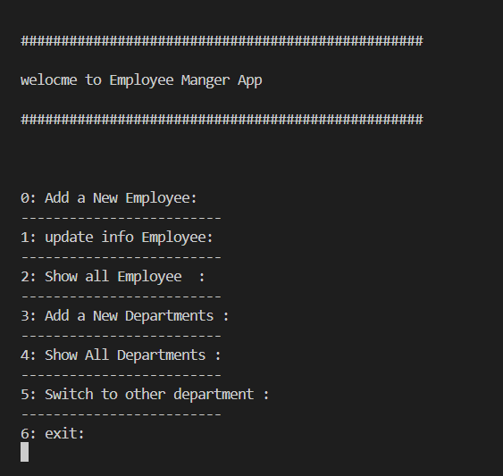
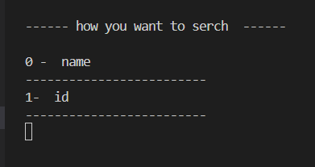
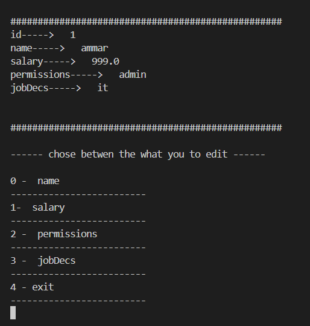

 # **welcome to company app**

 ### it will be use to mange employee from different departments

## list of instructions

=============================================

1. 0 : for add new employee you give name and salry and it job and the permissions

2. 1 : to update employee info 
---
*  update by name or id  

* after that you can chose what you want to update the permissions you can only chose form list admin or read or write

================================================

---

3. 2 : will show you all employee in this department

4. 3 : will alow you to add new department to the system that have is own employee

5. 4 : will show all departments in the system

6. 5 : will switch to other department that have is own employee

   

