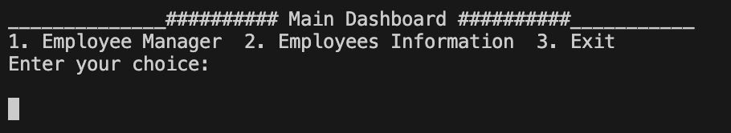
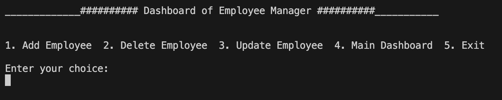
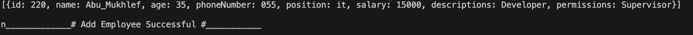

# Simple Employee Manager :desktop_computer:
a simple application to manage employees where users can add new employees, assign permissions, display their data, and modify their salaries, permissions, and job descriptions.

---

# It is imperative to verify that the <!--Links-->[Dart](https://dart.dev/)<!--Links--> language is installed on your machine before proceeding.

## Features
1. ###### Add New Employee
2.  ###### Update Employee
3. ###### Delete Employee
4. ###### Display Employee

## how to use it
* You **must** initially add an employee, you must repeat this process every time you start. Why? Because we store in a list, not in a database, **so you must pay attention to that**.

___

### choice Number 1

---
### choice Number 1

### out put will be like this

---