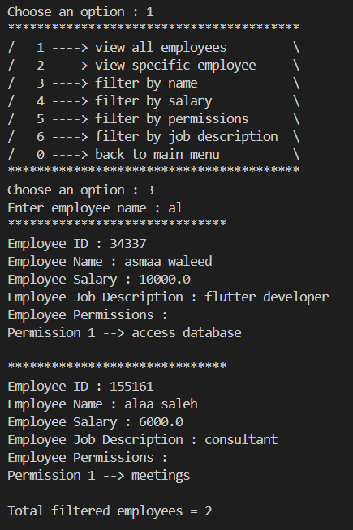

# Employee Manager App 💼

 

# 1. Introduction 📖
Nowadays, managers needs to digitalize their style of work and depend on a reliable system which can store their employees data and deal with it in many possible ways.

### 1.1 Overview 🔎
Employee Manager App is a command-line program helps managers store their employees data in an efficient way, allowing them to retrieve and modify employees data whenever possible.

### 1.2 Target 🎯
Employee Manager App is mainly dedicated to managers and anyone want to start their journey as business owners.

# 2. Key Features 🔑
Here are some key features the program provides :

- **Add / Remove Employees** : Managers are able to add employees to their company. similarly, managers are able to remove a specific employee from their company.
- **Modify Employees Info** : Managers can modify employees info after accessing their profile through the employee ID.
- **Display Employees** : Managers can display employees with their info, also filters them by a specific criteria.
- **Promote an Employee** : Managers are able to give an employee a promotion, which is basically a raise in employee salary 💰.

# 3. Detailed Procedure (Start to End)
In this section, We will discuss all the detailed steps a manager can take in the employee manager program.

## 3.1 App Menu (mode = 'main')
After running the application using the command `dart run`, the application menu will appear to the manager in `main` mode, detailed information about menu modes will be explained in the next sections.

The app menu in `main` mode provides managers several options. To select an option, managers should enter the option number and click `Enter`.
At the moment, managers should either choose option `2` or `0` because they have not added any employee yet.

 

Options in `main` app menu are the following :

1. **View Employees** : Manager can view employees based on a specific filter, either by name, salary, etc.
2. **Add a New Employee** : By Entering option `2`, managers will be navigated to employee addition page, where they can fill employee info then add them to the company.
3. **Promote an Employee** : This option will promote an employee based on the given employee ID by manager.
4. **Modify Employee Info** : This option will allow manager to modify employee info such as name, permissions, etc.
5. **Remove an Employee** : This option will remove an employee from the company based on the given employee ID by manager
6. **EXIT** : This option will end the program.

## 3.2 Add a New Employee
In this process, manager should provide the program with the information of the employee they want to add to the company.

### 3.2.1 Generate Employee ID
Firstly, the program will generate a random employee ID consists of 6 digits.

### 3.2.2 Get Employee Info
Manager should provide the employee info satisfying the following conditions :
1. Name : should only contain english alphabet.
2. Salary : should be a number.
3. Job description : should contain english alphabet.
4. Permissions : shouldn't be more than 3, each of them is a string.

### 3.2.3 Employee Addition
Finally, the employee object will be created with the given info and added to the company.

## 3.3 View Employees
In this process, the menu will switch mode to `filter` mode where manager can select employee filteration options based on some property.

Filteration options :
- None
- Specific Employee
- Filter by Name
- Filter by Salary
- Filter by Job Description
- Filter by Permission

Example :

## 3.4 Modify Employee Info
By selecting Modify Employee Info from main menu, menu will switch mode to `modify`, Suppose we want to add permission to an employee with ID 65322. We can select add permission from the modify menu and enter the permission.

Oh no 😥 Looks Like Employee 65322 is busy enough and can't handle more permissions, Maybe he deserves a **promotion** 😉.

Let's try another employee.

Permisson is added successfully ✅

## 3.5 Promote an Employee
We didn't forget Employee 65322 who's dedicated and loyal employee, they can gain a promotion from managers by entering `3` from the `main` menu and then enter the employee ID.

## 3.6 Remove an employee
Unfortunately, managers sometimes have strict policy and want to release some employees. To do so, managers should enter `5` from the `main` menu and enter the employee ID.

 

# 4. Conclusion 🏁
By using Employee Manager App, managers will be able to deal with employees data in a smooth way allowing them to add, modify, or remove an employee to/from their company.

#### Author : Yaser Alkhayyat