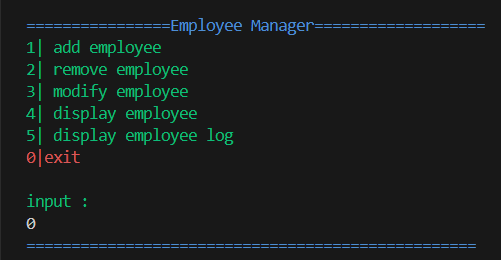
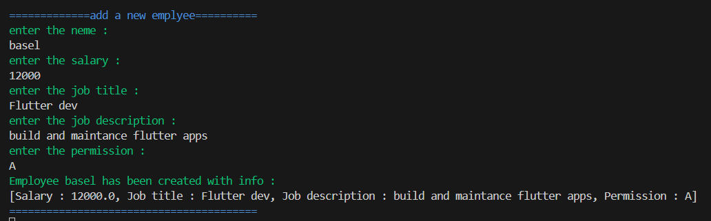
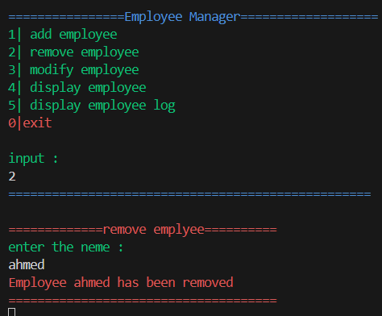
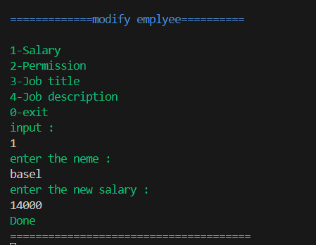
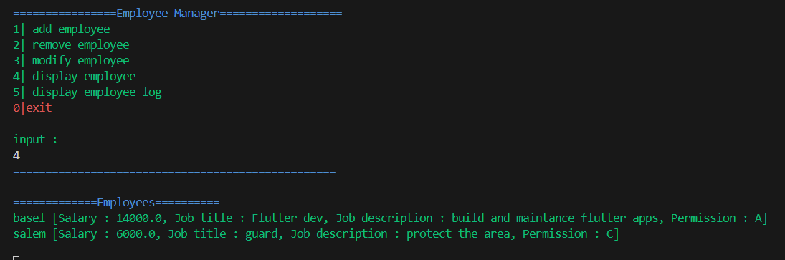

### Simple Employee Manager app

#### Project Idea:
Dart project to manage employees where users can add new employees, assign permissions, display their data, 
and modify their salaries, permissions, and job descriptions.

### Main Features

#### Add Employee

#### Remove Employee

#### Modify Employee

#### Display Employees

#### Track Employee Log
to show employee log the app will make sure the permission in class A
if it is not will deny the request
##### wrong acsses

##### right acsses

@Basel-75 - github
