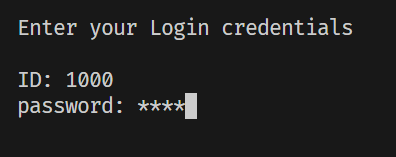
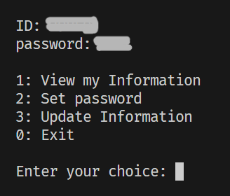
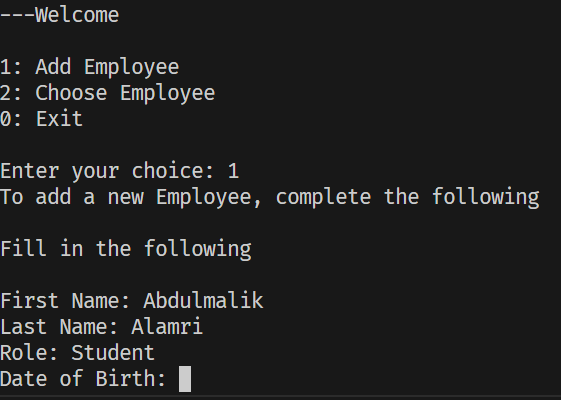
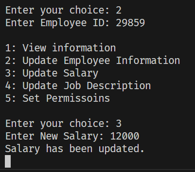

### Employee Management System

The Employee Management System is a console-based application built using Dart. It provides functionalities to manage employee data, including adding new employees, updating employee information, setting permissions, and handling user authentication.

### Features

- **Admin:** Add, view, update, and delete employee information.
- **Employee** view, update information including password.

- **Authentication:** Secure login with hashed passwords.
- **File Management:** Get data using JSON files for employees, logins, and permissions.
- **Password Management:** Update passwords with SHA-256 hashing for security.

### Instructions

- Login with your Employee ID and Password

# For Employees

- Enter 1 to View your Information
- Enter 2 to Set a new Password
- Enter 3 to Update your Information
- Enter 0 to Exit

# For Admin

- Enter 1 to Add new Employee (Fill in all information)

- Enter 2 Choose Employee to Modify (choose by Employee ID)
**Employee chosen**
- Enter 1 to View Employee Information

- Enter 2 to Update Employee Information
- Enter 3 to Update Salary

- Enter 4 to Update Job Description
- Enter 5 to Set Permissoins

- Enter 0 to Exit

