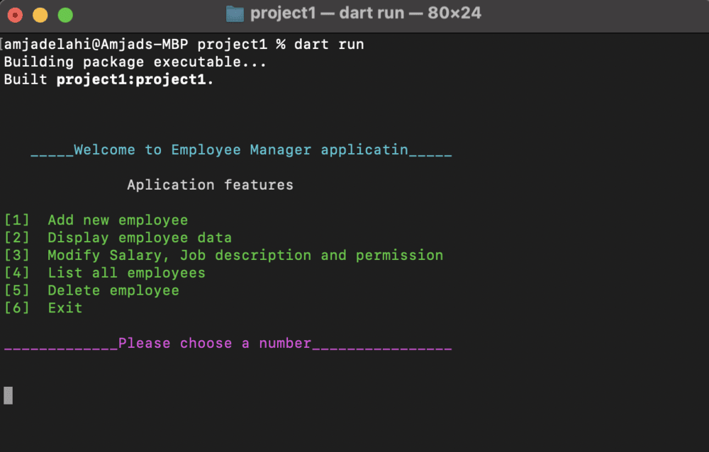
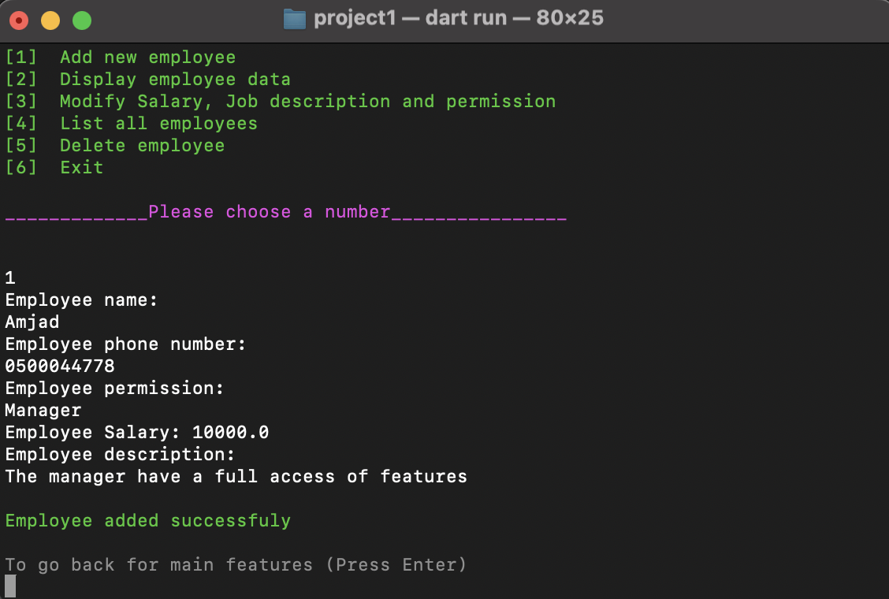
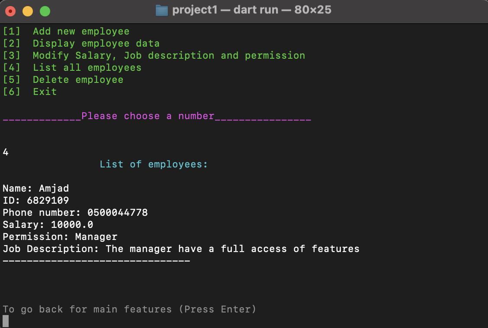

# Simple Employee Manager

#### The simple employee manager is an application for manage employees, allow users to add employee, assign permission, display employee data, list all employee, remove an employee and modifying the salaries, permissions and job descriptions.

## Requirements

#### This project require a command line interface (CML) to run the application.

## How to run the project

#### 1. Open terminal or CMD.
#### 2. Navigate to the project path, such as 
```bash
cd /Users/amjadelahi/dart-bootCamp/Project-1/project1
```
#### 3. Run the application with a command: 
```bash
dart run
```
#### then the app's features and greeting message will be displayed to you, like the one in the picture below..

 <div style="width:50%; margin: auto;">

 
</div>

#### 4. Select a number (for example, number 1) to add an employee, then complete the data

<div style="width:50%; margin: auto;">

 
</div>

#### 5. Use the key (Enter) to return to the main features.
#### 6. In order to access the feature 2, 3 and 5, you need the employee's ID.
#### 7. Select number 4 to obtain the employee's ID.

<div style="width:50%; margin: auto;">


</div>

#### 8. Copy ID number
#### 9. For modification choose number 3 and entering the employee's ID, a list containing the items to be modified will appear. Let's change the salary, for example.

***Note: Modify salary only if employee work for an overtime hours***

<div style="width:50%; margin: auto;">


</div>

#### 10. In order to modify the job description and permissions, navigate to the major features, choose number 3, and then choose the number you want of either.
#### 11. Finally, select number 6 to exit the app.

