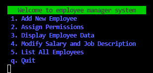

# Employee Manager System:

This is a simple employee management system written in Dart. It allows you to add new employees, assign permissions, modify existing employee data (salary and job title), display individual employee information, and list all employees.

# Features:

<ul>
<li>Add new employees with name, salary, and job title.</li>
<li>Assign permission to existing employees (grants access to data).
</li>
<li>Modify salary and job title of existing employees.
</li>
<li>Display individual employee information by ID.
</li>
<li>List all employees with details (ID, name, job title, salary, permission status, and date created).
</li>
</ul>

# How to Use

Run the program using dart main.dart.

You will be presented with a menu:

# Note:

This is a basic program and doesn't persist data after the program exits.

User input is validated to ensure numbers are entered when expected.

# Dependencies:
This program requires the intl package for date formatting. You can install it using pub install intl. this package allows formatting Date.now()
