

# Simple employee manager

## Objective:
 **A user-friendly application for managing employees** that provides a range of features, including:

- Adding new employees.
- Assigning permissions.
- Displaying employee data.
- Listing all employees and their key details.
- Modifying employee salaries, permissions, and job descriptions.

## How does it work?
#### 1. In terminal write `dart run` to start.
 **Menu:**

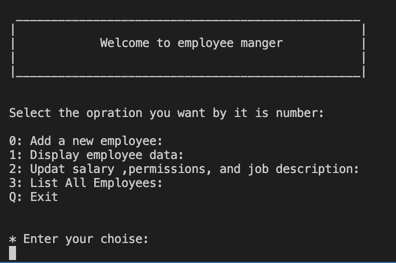

 

#### 2. Enter number of opration you want to perform:
  - you can use **"add a new employee"** function: to add a new employee by entring employee name, employee jop description, set employee salary that must exceed 5000, and specify at least one permission from a set by entering permissions separated by commas (,).
   **example:** 
  

  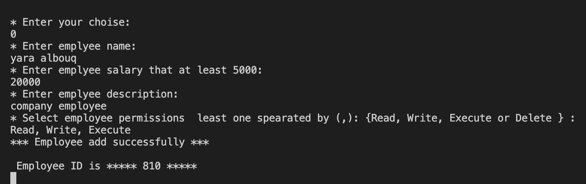

  - To display employee data by employee ID use **"display employee data"** function that will display employee data like employee name, employee ID, employee job description, employee salary, employee permission, employee start date, and employee work days. 
  **example:** 
   

   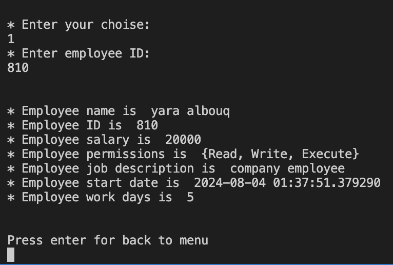

  - To update data by employee ID use **"updat salary ,permissions, and job description"** function which help in update job description, set employee salary that must exceed 5000, or specify at least one permission from a set by entering permissions separated by commas (,).**examples:** 
  

  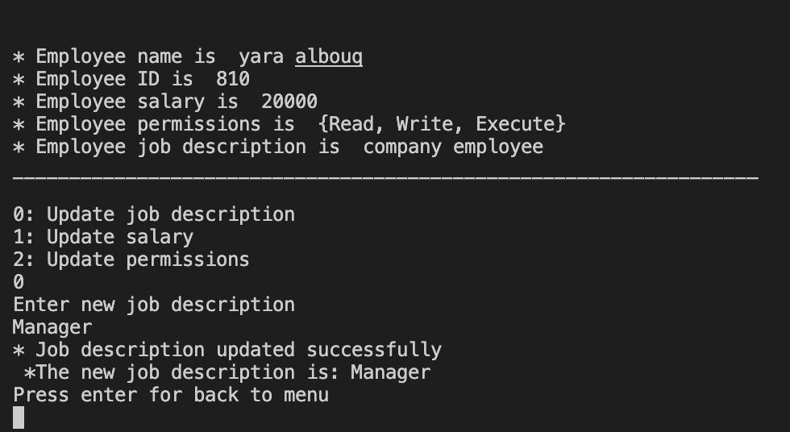

  

  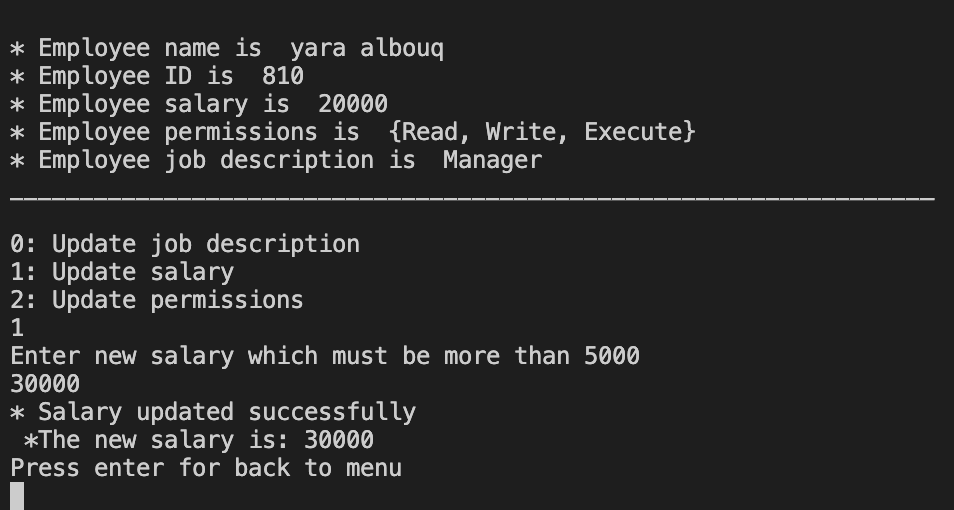

  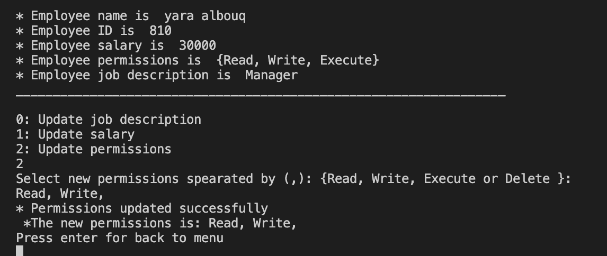

  - Selecting **"List All Employees"** function will display all employees along with their key details, and will also show the total number of employees in the system.
  **example:** 
  

  

#### 3. for exit enter `Q` or `q`

 
## Guidelines: 
- in **"add a new employee"** if you did not enter employee name, and job description it will appear as empty.**example with output:** 

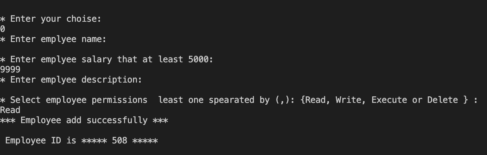

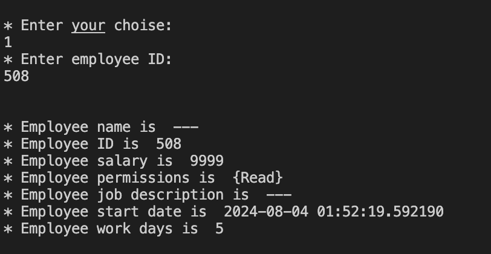

- in **"add a new employee"** if you enter salary less than 5000 it will print (Salary must be more than 5000) massage. **example:** 

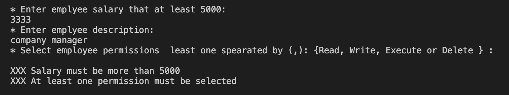

- in **"add a new employee"** if you did not enter permission it will prent (At least one permission must be selected) massage.
**examples:** 

- in **"add a new employee"** if you enter permission not in the set it will print (Invalid permission: ) massage. **examples:** 

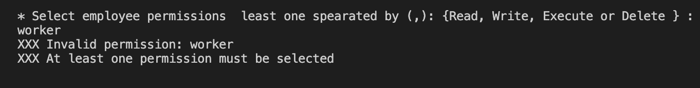

- in **"display employee data"** and **"Updat salary ,permissions, and job description"** if you enter wrong employee ID it will print (Employee ID is not found!) massage. **examples:** 

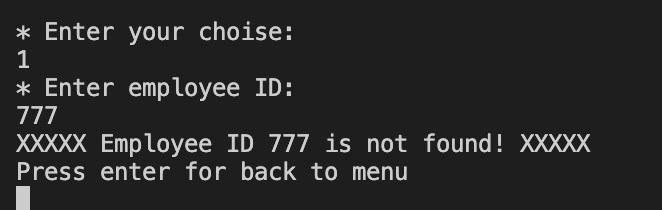

## Bulit with: 
Dart language

